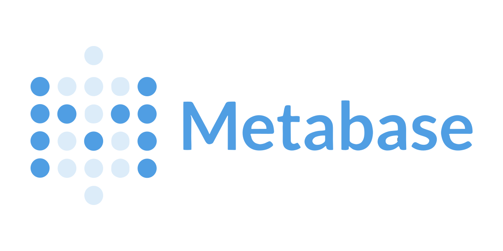

## Sumário

[1. Comparativo das ferramentas ](#c1)

[2. Configuração da ferramenta ](#c2)

[3. Importação dos dados](#c3) 

[4.  Criação de gráficos](#c4)

<br>

# <a name="c1"></a>1. Comparativo das ferramentas

|                   |   |  |  |  |
|-------------------|--------------------------|-------------------------|------------------------|-----------------------|
| **Facilidade de Uso** | Conhecido por sua simplicidade e facilidade de uso. Mais direcionado para usuários menos técnicos. | Amigável, especialmente para quem tem experiência em métricas e painéis. Pode exigir mais configuração inicial. | Interface intuitiva, projetada para usuários de negócios sem habilidades técnicas avançadas. | Integrado ao ecossistema Microsoft, oferece uma interface amigável e familiar para usuários do Excel. |
| **Conectividade**    | Oferece suporte a bancos de dados, incluindo Redshift. |  Utilizado para monitoramento, suporta bancos de dados, incluindo Redshift. | Integração direta com Redshift e outras fontes de dados populares. | Integração nativa com serviços da AWS, incluindo Redshift.                       |
| **Recursos de Visualização** | Oferece visualizações básicas, pode ser limitado em recursos avançados. | Focado em visualizações de séries temporais e métricas, mas possui recursos gráficos robustos. | Reconhecido por sua ampla gama de recursos de visualização e análise. | Rico em recursos visuais e capacidades de análise.                               |
| **Colaboração**     | Adequado para colaboração básica, mas pode ser limitado em recursos avançados de colaboração. | Oferece recursos de compartilhamento e colaboração, mas pode exigir configuração adicional. | Excelente para colaboração, permite a criação de painéis interativos. | Integra-se ao ambiente de colaboração da Microsoft, facilitando o compartilhamento. |
| **Custo**           | Código aberto e gratuito. | Código aberto e gratuito, com opções pagas para recursos adicionais. | Pago. Oferece opções de licenciamento. | Oferece uma versão gratuita limitada e opções pagas para maior capacidade e recursos. |

## 1.1 Justificativa da ferramenta escolhida

A escolha é o Metabase. Em primeiro lugar, o Metabase é uma opção de código aberto e gratuita, permitindo um investimento direcionado em outras áreas do projeto. Em segundo lugar, sua interface é intuitiva e fácil de configurar, sendo especialmente vantajosa para estudantes que podem não ter conhecimento em Business Intelligence (BI).

Além disso, o Metabase destaca-se por sua capacidade de se integrar a diversas fontes de dados, incluindo o AWS Redshift. Isso é fundamental, pois os dados já estão configurados na AWS, tornando a integração simplificada. Em terceiro lugar, o Metabase oferece a flexibilidade para a criação de painéis e relatórios personalizados, permitindo adaptação às necessidades específicas do cliente.

Pontos específicos que destacam o Metabase :

**BI Self-Service:**

O Metabase é uma ferramenta de BI self-service, o que significa que os usuários podem criar seus próprios painéis e relatórios sem depender de um profissional de BI. Isso promove a autonomia e agilidade na análise de dados.

**Recursos de Visualização Abrangentes:**

Oferece uma variedade de recursos de visualização, incluindo gráficos, tabelas e mapas. Essa diversidade proporciona a flexibilidade necessária para criar painéis visualmente atraentes e informativos, atendendo às diferentes preferências de análise.

**Integração com AWS Redshift:**

A capacidade de integração direta com o AWS Redshift é essencial para garantir que o cliente possa aproveitar os dados existentes na AWS sem complicações.


# <a name="c2"></a>2. Configuração da ferramenta 

## Docker

### Passo 1: Preparando o Sistema

1. Atualize o Windows: Na barra de pesquisa, digite "Windows Update" e execute a atualização do sistema.

2. Abra o CMD como Administrador: Na barra de pesquisa, digite "CMD," clique com o botão direito e selecione "Executar como administrador."

3. Ative o WSL 1: No CMD, insira o comando:
   ```CMD
   dism.exe /online /enable-feature /featurename:Microsoft-Windows-Subsystem-Linux /all /norestart
    ```

### Passo 2: Atualizando para WSL 2

1. Instale o Virtual Machine Platform (VMP): Execute o comando no CMD:
    ```CMD
    dism.exe /online /enable-feature /featurename:VirtualMachinePlatform /all /norestart
    ```

2. Reinicie o PC.
3. Abra o CMD como Administrador novamente e insira:
    ```CMD
    wsl --set-default-version 2
    ```

### Passo 3: Instalando o Docker

1. Baixe o Docker Desktop no Docker Hub:
  
   https://docs.docker.com/desktop/install/windows-install/ 

2. Depois de baixar o Docker Desktop Installer.exe
    
    Execute o seguinte comando em um terminal para instalar o Docker Desktop:
    ```CMD
    "Docker Desktop Installer.exe" install
    ```

3. Se estiver usando o prompt de comando do Windows:
   ```CMD
   start /w "" "Docker Desktop Installer.exe" install
    ```

4. Se sua conta de administrador for diferente de sua conta de usuário, você deverá adicionar o usuário ao grupo docker-users :
    ```CMD
   net localgroup docker-users <user> /add
    ```

5. O Docker Desktop não inicia automaticamente após a instalação. Pesquise Docker e selecione Docker Desktop nos resultados da pesquisa. O menu  exibe o aplicativo baixado. 


## Executando o Metabase com Docker

**Observação:** Certifique-se de que o Docker está instalado e em execução.

1. Obtenha a imagem mais recente do Metabase:
    ```bash
    docker pull metabase/metabase:latest
    ```

2. Inicie o contêiner Metabase na porta 3000:
    ```bash
    docker run -d -p 3000:3000 --name metabase metabase/metabase
    ```

3. Opcional - Para visualizar os logs durante a inicialização, execute:
    ```bash
    docker logs -f metabase
    ```
4.  Após a inicialização, acesse sua metabase em http://localhost:3000.


# <a name="c3"></a>3. Importação dos dados

Agora que o Metabase está iniciado, siga os passos abaixo para importar dados e configurar seu banco.

## Acessando o Metabase

1. Abra seu navegador e acesse http://localhost:3000. Faça login ou crie uma conta no Metabase.


2. Após o login, você será direcionado ao menu inicial do Metabase.


3. No menu lateral, clique em "Explorar Dados."


4. Na janela que se abrirá, serão exibidos os dados cadastrados na sua conta.


## Configurando um Banco de Dados

1. Vamos agora configurar um banco de dados. No menu superior, clique em "Início," depois em "Configurações," e selecione "Configurações de Admin."


2. Na janela de configurações de admin, clique em "Banco de Dados."


3. Clique em "Adicionar Banco de Dados."


4. Preencha as informações do seu banco e clique em "Salvar."


**Observação :** Se estiver utilizando o Redshift, as informações do servidor podem ser encontradas dentro do seu workgroup, sendo a URL do endpoint.


5. Aguarde a sincronização e a conexão será estabelecida com sucesso.


6. Aqui, o banco de dados "Exemplo" foi conectado com sucesso.


## Visualização dos dados

Para visualizar os dados do banco criado, siga estes passos:

1. **Sair do Modo Administrativo:**  Clique em "Sair do ADM."


2. **Explorar Dados:** No menu principal, selecione "Explorar Dados."


3. **Selecionar o Banco de Dados Criado:** No card do banco de dados "Exemplo" que criamos, clique para acessar.


4. **Visualizar Dados Importados:** A página apresentará todos os dados importados da nossa conexão. No exemplo, os dados estavam carregados em um Redshift da AWS.


# <a name="c4"></a>4. Criação de gráficos

Acesse o [link](https://www.youtube.com/watch?v=Asmu6kuXYqU) para visualizar desde o processamento dos dados até a criação e análise de um dashboard no Metabase.


